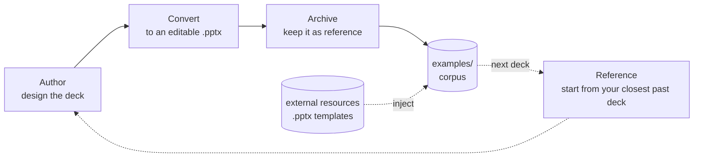

# 📊 deck-maker

Design a slide deck as HTML with Claude Code, convert it to a **real, editable
PowerPoint** 📽️ — native text, tables, charts, shapes. Not images.

What/how: **[docs/overview.md](docs/overview.md)**. This page: install & use.

## Install

Requires [Bun](https://bun.sh) 1.3+.

```sh
git clone https://github.com/iteam1/deck-maker.git
cd deck-maker
bun install
bun link        # puts `deck-maker` on your PATH (~/.bun/bin)
```

Verify:

```sh
deck-maker check examples/index.html    # → "13 slide(s), 0 issues, 0 critical"
```

No link? Run in place: `bun /path/to/deck-maker/src/cli.ts …`

## Use with Claude Code

Four skills ship in `skills/`: **deck-author** (writes the HTML), **deck-convert**
(runs the engine), **deck-inspect** (reads an existing `.pptx`'s content/style), and
**deck-archive** (saves a shipped deck to a reusable corpus). Install either way:

```sh
# A — plugin:
/plugin marketplace add /path/to/deck-maker
/plugin install deck-maker

# B — copy skills (global, or into a project's .claude/skills/):
cp -r skills/deck-author skills/deck-convert skills/deck-inspect skills/deck-archive ~/.claude/skills/
```

Then, from any project:

> "Make me a deck about our Q2 results."

Claude writes `deck.html`, you review it in a browser, and on your OK it produces
`deck.pptx`. The starting point is a **matching past deck** if you've made one — else the
[worked examples](examples/) (Swiss QBR + Aurora pitch). Keep the deck and it's archived,
so the next one seeds from it: deck-maker gets more on-brand the more you use it.



The dotted path is the self-improving part: each deck you keep makes the next one start
closer to done.

## CLI

```sh
deck-maker check   deck.html              # validate geometry
deck-maker convert deck.html deck.pptx    # check + convert
deck-maker inspect existing.pptx          # read an EXISTING pptx's content + style as JSON
deck-maker archive deck.html deck.pptx    # save a shipped deck to the reusable corpus
deck-maker archive nice.pptx              # or drop in a bare starter (no html) as a reference
deck-maker archive --list                 # list the corpus as JSON
```

Opens in PowerPoint, Keynote, Google Slides, LibreOffice. `inspect` (see **deck-inspect**)
is one-way and read-only — it pulls text/tables/chart data/image refs *and* style (color
palette, fonts, type scale, rounded-vs-square corners) out of any `.pptx` for reuse or to
match an existing deck's look; it does not reconstruct an editable `deck.html`. `archive`
(see **deck-archive**) saves a kept deck — html + pptx + an auto-filled `SUMMARY.md` card —
into a corpus (default `examples/`, or `DECK_MAKER_ARCHIVE_DIR`) so the next deck can seed
from it; the cards' style fields come from `inspect`. You can also drop a bare `.pptx` into
the corpus as a style reference — `--list` synthesizes its card by inspecting it, no html
or summary required.

## Starter decks — seed the corpus

Grab nice, **editable** `.pptx` (not image-only — `inspect` needs native objects) for
business/tech decks and drop them in as references:

- [PresentationGO](https://www.presentationgo.com/) — free, no signup, direct `.pptx`
- [SlideEgg](https://www.slideegg.com/free-powerpoint-templates) — free `.pptx`, states royalty-free / commercial / no-attribution
- [Slidesgo](https://slidesgo.com/business) · [tech](https://slidesgo.com/technology) — polished; free tier limited
- [SketchBubble](https://www.sketchbubble.com/en/free-powerpoint-templates) — proper color/variant theming, extracts cleanly
- [Microsoft templates](https://powerpoint.cloud.microsoft/create/en/templates/) · [Template.net pitch decks](https://www.template.net/pitch-deck/ppt) — native, safe licensing

Then `cp deck.pptx "$DECK_MAKER_ARCHIVE_DIR"/` (or the install's `examples/`) and
`deck-maker archive --list`.

**Licensing:** using a downloaded template privately as a style seed is fine; redistributing
the template file is what licenses restrict — so keep the corpus **local** (it's gitignored,
never committed), and prefer the no-attribution sources if a *derived* deck ships externally.

## Docs

- [docs/overview.md](docs/overview.md) — what it is, the fidelity ladder
- [docs/design.md](docs/design.md) — engine internals
- [docs/IR.md](docs/IR.md) — the `Deck` IR contract
- [skills/deck-author/references/design.md](skills/deck-author/references/design.md) —
  the design playbook

## Related to

- [open-design](https://github.com/nexu-io/open-design)- 🎨 The open-source Claude Design alternative. 🖥️ Local-first desktop app. 🖼️ Your coding agent becomes the design engine: prototypes, landing pages, dashboards, slides, images & video — real files, HTML/PDF/PPTX/MP4 export. 🤖 Claude Code / Codex / Cursor / Gemini / OpenCode / Qwen & 20+ CLIs via BYOK. 
- [Harness design - Anthropic](https://www.anthropic.com/engineering/harness-design-long-running-apps)- Harness design for long-running application development