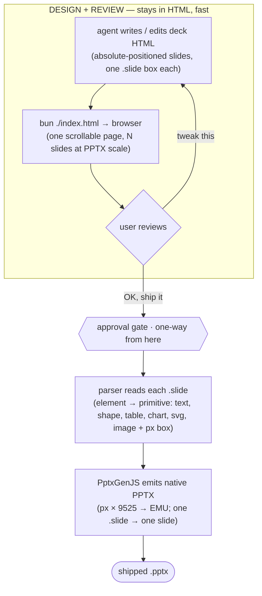

# deck-maker

AI vibe-designs the deck. The output is a **real PowerPoint file** — not a stack of images.

Tools like NotebookLM generate slides as rasterized pictures: they blur when you zoom,
and nothing can be edited afterwards. deck-maker's rule is the opposite: **every element
lands in the highest-fidelity native PPTX object PowerPoint can manipulate.** Never
flatten structure into pixels.

Built with **Bun + TypeScript**.

## The fidelity ladder

| Content | PPTX output | What the user can do |
|---|---|---|
| Text | Native text box | Edit, search, restyle — reflows on font change |
| Table | Native PPTX table | Edit cells, resize columns, restyle borders — never an image of a table |
| Chart | Native chart object **with embedded data** | Right-click → **Edit Data**, chart redraws |
| Diagram / icon / illustration | SVG vector | Infinite zoom; "Convert to Shape" explodes it into editable vectors |
| Boxes, arrows, callouts | DrawingML autoshapes | Move, recolor, reconnect |
| Photo | PNG/JPEG | Last resort — only for content that is genuinely raster |

Rasterization is an explicit escape hatch for the few CSS effects with no PPTX
equivalent (blend modes, filters, clip-paths) — applied **per element**, never to a
whole slide.

## How it works: HTML in, native PPTX out

LLM agents are excellent at HTML/CSS and terrible at raw DrawingML — so HTML is the
**design medium**, never the output format. To keep conversion trivial, slides are
authored as **absolutely-positioned HTML on a fixed slide-sized canvas**: the source
already carries every coordinate, so converting to PPTX is plain parsing — no headless
browser, no layout engine. The agent and user iterate entirely in HTML; conversion
happens **once, on approval**.



Three conventions make the convert step pure parsing:

- **Fixed canvas** — each slide is one `1280×720` `.slide` box (`overflow: hidden`), the
  16:9 slide at 96dpi. `1px = 9525 EMU`, so px→PPTX is a single constant.
- **Explicit geometry** — every element carries its absolute `left/top/width/height`, so
  a TypeScript parser reads coordinates straight from the source. No CSS to resolve.
- **Same DOM for both** — the page the user reviews is exactly what gets parsed, so what
  you approve is what converts, slide-for-slide.

### Charts need semantic marking

If the agent *draws* a chart in HTML/SVG, a faithful converter produces frozen vector
art — no Edit Data. Instead the agent embeds the **data** on the element and the parser
builds a native chart from it:

```html
<div class="chart-box" data-chart='{
  "type": "bar",
  "categories": ["Q1", "Q2", "Q3", "Q4"],
  "series": [{"name": "Product A", "values": [4.2, 5.1, 6.3, 7.4]}]
}'></div>
```

### Known gotchas

- **Text reflow** — PowerPoint wraps text with its own font metrics; a line that fits in
  Chrome can wrap differently in PPT. Use fixed boxes with slack, match fonts, and render
  the finished PPTX back to images to confirm before shipping.
- **Unmappable CSS** — blend modes, filters, clip-paths have no PPTX equivalent;
  rasterize those elements individually, keep everything else native.

## Output library

**[PptxGenJS](https://github.com/gitbrent/PptxGenJS)** writes the file — TypeScript-native,
with native charts, tables, and SVG out of the box.
[python-pptx](https://python-pptx.readthedocs.io/en/latest/) is the Python alternative if
the roadmap ever needs editing existing decks or filling corporate templates; PptxGenJS is
write-only.

## Related to

https://github.com/gitbrent/PptxGenJS

https://python-pptx.readthedocs.io/en/latest/
