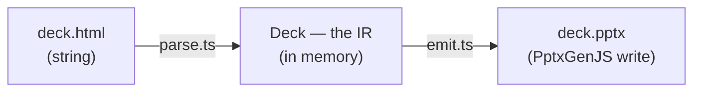

# deck-maker — internals

_Pitch, fidelity ladder, and HTML conventions live in the [README](../README.md). This is
the engineering view: repo layout, dataflow, workflow._

## Repo layout

```
skills/
  deck-author/    skill — how to write deck.html in the required format
    references/
      design.md      the design playbook (palette, type scale, archetype pool)
      themes.md      named palettes + the --od-* theme-slot contract
      checklist.md   pre-handoff gate
  deck-convert/   skill — how to run the CLI to convert it
examples/
  index.html      the full worked example / starter deck (copy + adapt)
  assets/         image assets referenced by the example
src/
  cli.ts          verbs: convert (check + emit), check (geometry gate only)
  parse.ts        HTML → Deck (the IR)
  check.ts        Deck → violations (canvas bounds, footer rail, chart sanity)
  emit.ts         Deck → PptxGenJS → .pptx (repacks OPC, rasterizes SVG)
  types.ts        the IR types shared by parse + emit
```

- **engine** = `parse.ts` + `emit.ts`, decoupled by the **IR** (`Deck`): parse never
  touches PptxGenJS, emit never touches HTML.
- **cli** drives the engine.
- **skills** teach Claude Code to author conforming HTML (`deck-author`) and run the CLI
  (`deck-convert`).

## Dataflow



The IR — a `.slide` box → `Slide`, each positioned child → `Element`:

```ts
type Box = { x: number; y: number; w: number; h: number }   // px, from inline left/top/width/height

type Deck  = { slides: Slide[] }
type Slide = { w: number; h: number; elements: Element[] }  // 1280 x 720

type Element =
  | { kind: 'text';   box: Box; runs: TextRun[]; align?: 'left' | 'center' | 'right' }
  | { kind: 'shape';  box: Box; shape: 'rect' | 'ellipse' | 'arrow'; radius?: number; stroke?: { color: string; width: number } }
  | { kind: 'table';  box: Box; rows: string[][] }
  | { kind: 'chart';  box: Box; spec: ChartSpec }        // from data-chart JSON
  | { kind: 'svg';    box: Box; svg: string }
  | { kind: 'image';  box: Box; src: string }

type TextRun  = { text: string; size?: number; bold?: boolean; italic?: boolean; color?: string; font?: string }
type ChartSpec = { type: 'bar' | 'line' | 'pie' | 'doughnut'; categories: string[]; series: { name: string; values: number[] }[]; colors?: string[] }
```

Geometry and style are read from inline `style` / `data-*` only — no CSS cascade, so no
layout engine. `emit.ts` converts `px / 96 → inches` for PptxGenJS.

## Workflow


