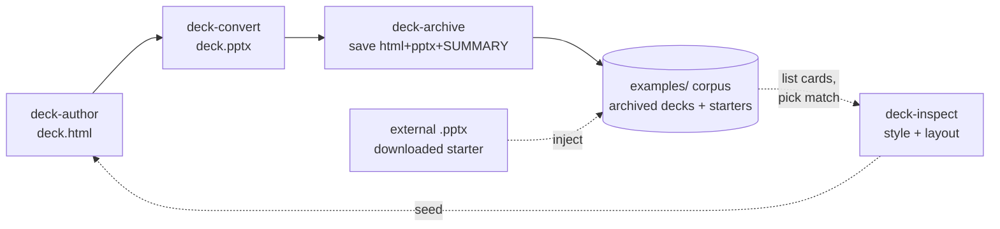

# Self-Improving — the archive loop

_Status: **implemented.** `deck-maker archive` + the **deck-archive** skill ship it; the
reference side is **deck-author** step 0._

deck-maker forgets every deck the moment it ships. This makes it remember: decks you keep
become the reference for the next one, so each deck starts from your closest past deck
instead of a generic example.

## The loop



1. **Author** — `deck-author` writes `deck.html`.
2. **Convert** — `deck-convert` emits `deck.pptx`.
3. **Archive** (new `deck-archive`) — on a deck you keep, save `deck.html` + `deck.pptx` +
   a `SUMMARY.md` into its own folder under `examples/`.
4. **Reference** — next deck, first list the corpus cards and pick a match (type, style,
   brand).
5. **Deep-dive** — if one matches, `deck-inspect` its `.pptx` for the exact palette/fonts.
6. → back to **Author**, seeded from that instead of the generic example.

**External inject** (dotted branch above): the corpus isn't only decks you authored — drop
any nice `.pptx` (a downloaded business/tech template) straight into it, no html or summary
needed. `deck-archive --list` synthesizes its card by inspecting it, so it's matchable and
seedable exactly like an archived deck. This is how an outside look enters the loop.

## `deck-archive`

One folder per kept deck:

```
examples/2026-07-07-aurora-q2-review/
├── deck.html
├── deck.pptx
└── SUMMARY.md
```

`SUMMARY.md` — a short index card: title, date, type (qbr/pitch/sales/talk), language,
palette + fonts (lift from `deck-inspect`), and one line on what worked / reuse it for.

That's it — matching is just reading the cards and inspecting the winner. `deck-inspect`
already pulls the style, so the archive only has to store and index it.
